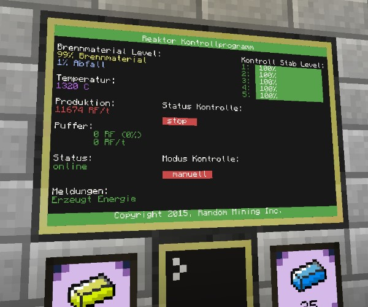

# ComputerCraft LUA Scripts

## Table of Contents

<!-- TOC -->
* [1. Purpose](#1-purpose)
* [2. Available Programs](#2-available-programs)
* [3. Available APIs](#3-available-apis)
  * [3.1. `fuel`](#31-fuel)
  * [3.2. `gui`](#32-gui)
  * [3.4. `l10n`](#34-l10n)
  * [3.5. `reactor`](#35-reactor)
  * [3.6. `strip`](#36-strip)
  * [3.7. `torch`](#37-torch)
* [4. License](#4-license)
<!-- TOC -->

---

## 1. Purpose

This small collection of [ComputerCraft][1] LUA APIs and scripts was used on the
[Minecraft][2] servers on [Random-Host.tv][3]. They may not be very fancy and
potentially buggy, but they did the job back in 2015.

You can use them if you want, but don't expect any support.

[🡹 Back to top](#table-of-contents)

## 2. Available Programs

These programs make heavy use of ComputerCraft APIs.

Even though most of the program's code should be self-explanatory, you may wish
to read the [Available APIs](#available-apis) section to learn more about the
APIs used within these programs and how those APIs are used to configure the
behavior of each individual program.

The following programs are included:

* `layer`  
   Mines a layer of blocks such as obsidian.

* `reactor`  
   Controls a passively cooled [BigReactors][4] reactor.

* `strip`  
   Classical strip mining program.

[🡹 Back to top](#table-of-contents)

## 3. Available APIs

An API (Application Programming Interface) is a collection of code that, rather
than being run directly by the user as a program, is meant to be used by other
programs.

To learn more about ComputerCraft APIs, please refer to the Computercraft Wiki's
[APIs][5] category.

The following APIs are included:

[🡹 Back to top](#table-of-contents)

### 3.1. `fuel`

Provides functions for auto-refueling turtles.

This API is primarily a dependency of the `strip` API.

* `fuel.check()`  

    Checks the fuel level of the turtle and attempts to refuel using the first
    suitable fuel item found in the turtle's inventory.

[🡹 Back to top](#table-of-contents)

### 3.2. `gui`

Provides functions for printing GUI items on monitors.

This API is primarily a dependency of the `reactor` API but could be used in
other programs as well.

* `gui.setTextScale(float scale)`

    Sets the text scale to be used for rendering text.
    
    Default: `0.5`

* `gui.setDefaultBackgroundColor(number color)`

    Sets the default background color for rendering GUI elements.
    
    Default: `colors.black`

* `gui.setDefaultForegroundColor(number color)`

    Sets the default foreground color for rendering GUI elements.
    
    Default: `colors.white`

* `gui.setBarBackgroundColor(number color)`

    Sets the background color for bar GUI elements.
    
    Default: `colors.green`

* `gui.setBarForegroundColor(number color)`

    Sets the foreground color for bar GUI elements.
    
    Default: `colors.white`

* `gui.setStatusBarActiveBackgroundColor(number color)`

    Sets the background color for active status bar sections.
    
    Default: `colors.green`

* `gui.setStatusBarActiveForegroundColor(number color)`

    Sets the foreground color for active status bars section.
    
    Default: `colors.white`

* `gui.setStatusBarInactiveBackgroundColor(number color)`

    Sets the background color for inactive status bar sections.
    
    Default: `colors.gray`

* `gui.setStatusBarInactiveForegroundColor(number color)`

    Sets the foreground color for inactive status bars section.
    
    Default: `colors.white`

* `gui.setMonitor(string monitorPosition)`

    Sets the monitor to be used.

* `gui.getMonitor()`

    Returns the monitor to be used.
    
* `gui.centerText(string text)`

    Renders the given text horizontally centered.

* `gui.displayTitleBar(string text)`

    Renders a title bar with the given text.

* `gui.displayFooterBar(string text)`

    Renders a footer bar with the given text.

* `gui.displayStatusBar(number x, number y, number length, string value, string label)`

    Renders a colored status bar of the given length.

[🡹 Back to top](#table-of-contents)

### 3.4. `l10n`

Provides functions for loading localization strings.

This API is primarily a dependency of all APIs which print text.

* `l10n.setLanguage(string language)`

    Sets the language code for the localization to be loaded.
    
    Default: `'en'`

* `l10n.getLanguage()`

    Returns the language code for the localization to be loaded.

* `l10n.load(string name)`

    Loads the localization file identified by the given name. This will usually
    be the name of the API which will be using the localization strings.

[🡹 Back to top](#table-of-contents)

### 3.5. `reactor`

Provide functions for controlling a [BigReactors][4] reactor.

* `reactor.setShutdownThreshold(number threshold)`

    Sets the shutdown threshold. This is the buffer fill level at which the
    reactor will automatically shut down.
    
    Default: `0.75` (75%)

* `reactor.setStartupThreshold(number threshold)`

    Sets the startup threshold. This is the buffer fill level at which the
    reactor will automatically start up when operating in "auto" mode.
    
    Default: `0.50` (50%)

* `reactor.setShowRodLevelBars(bool enable)`

    Sets if control rod level bars should be shown in the GUI.
    
    Default: `true`

* `reactor.setEnableRedstoneControl(bool enable)`

    Sets if auto startup requires a redstone signal. Setting this to `true` will
    cause the computer which the program is running on to require a redstone
    signal in addition to the reactor's internal buffer fill level being below
    the configured startup threshold before the reactor is started.
    
    This can be used to delegate auto startup control to an external device such
    as [Ender IO][6]'s [Power Monitor][7].
    
    Default: `false`

* `reactor.setMonitorName(string monitor)`

    Sets the name of the monitor which the GUI should be displayed on.
    
    Default: `'top'`
    
* `reactor.setReactorName(string reactor)`

    Sets the name of the reactor to be controlled.
    
    Default: `'BigReactors-Reactor_0'`

* `reactor.setRedstoneControlInput(string side)`

    Sets redstone control input side. This is the side from which the redstone
    signal for the external redstone control will be provided to the computer.
    
    See `reactor.setEnableRedstoneControl()` above for more information.
    
    Default: `'back'`

* `reactor.setOperationMode(string mode)`

    Sets the operation mode. This sets the initial mode the control program
    operates in (either `'auto'` or `'manual'`) when the computer is booted.
    
    The operation mode can be changed at runtime via the GUI.
    
    Default: `'manual'`

* `reactor.run()`

    Runs the reactor control program main loop. The program will keep running
    until the user hits a key or terminates the program by holding `[CTRL]+[T]`. 

[🡹 Back to top](#table-of-contents)

### 3.6. `strip`

Provides functions for strip mining using turtles.

* `strip.setStripHeight(number height)`

    Sets the height of the strip mining tunnels.
    
    Default: `4` (4 blocks)

* `strip.setStripLength(number length)`

    Sets the length of the strip mining tunnels. This must be an even number.
    
    Default: `40` (40 blocks)

* `strip.setStripCount(number count)`

    Sets the amount of tunnels to dig.
    
    Default: `4`

* `strip.setStripInterval(number interval)`

    Sets the interval of the tunnels.
    
    Default: `3` (every 3 blocks)

* `strip.setEnableTorches(bool enable)`

    Enables or disables placing of torches.
    
    Default: `true`

* `strip.setTorchSlot(number slot)`

    Sets the storage slot for torches.
    
    Default: `16` (inventory slot 16, counted from left to right)

* `strip.setTorchInterval(number interval)`

    Sets interval for placing torches.
    
    Default: `3` (every 3 blocks)

* `strip.run()`

    Runs the strip mining program with set parameters.
    
    When the program has finished, the turtle will remain at the last position.

[🡹 Back to top](#table-of-contents)

### 3.7. `torch`

Provides functions for placing torches.

This API is primarily a dependency of the `strip` API.

* `torch.setSlot(number slot)`

    Sets the storage slot for torches.
    
    Default: `16` (inventory slot 16, counted from left to right)

* `torch.place(bool placeUp)`

    Places a torch. If `placeUp` is set to `true`, the torch will be placed one
    block "above" the turtle's front side, otherwise it will be placed one block
    "below".

[🡹 Back to top](#table-of-contents)

## 4. License

See [LICENSE](LICENSE) for full license details.

[🡹 Back to top](#table-of-contents)

[1]: https://github.com/dan200/ComputerCraft
[2]: https://www.minecraft.net/
[3]: https://www.random-host.tv/
[4]: https://github.com/erogenousbeef-zz/BigReactors
[5]: https://computercraft.info/wiki/Category:APIs
[6]: https://github.com/SleepyTrousers/EnderIO
[7]: https://github.com/SleepyTrousers/EnderIO/wiki/Power-Monitors
